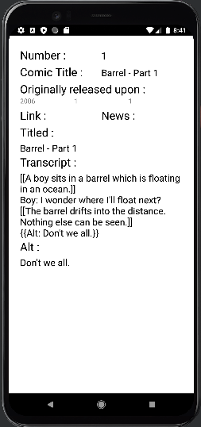

# xkcdViewer
Two Screen Kotlin Android Application utilizing the public api for [xkcd comics](https://xkcd.com/) available [here](https://xkcd.com/info.0.json) to create a simple comic strip viewer. 

## Implementation
The limitations of the public API means I cannot query a range of entries or chain requests like what may be possible with more sophisticated API's. The only lookups available are comicById and comicByLatest.

Both Screens (and their parent activity) are all served by a shared viewModel injected by Koin. The activity observes a boolean(easily replaceable with an enum of viewStates if project is expanded past two screens) that informs it which fragment should be showing in the framelayout. 
The fragments both observe uiState, and currentComicId so they know which Comic's content they should be rendering.

Screen 1: SingleComicViewFragment constraint layout to display a single comic image at a time, fresco for image loading. This view has a navigation bar which allows users to move through the Comics history in a limited fashion. These navigation arrows are the only way users are able change the current comic in the viewModel. There is lite logic to ensure the id never goes out of bounds. The navigation bar also features a (?) button which will show the Screen 2 with all of the metadata for the current comic.

Screen 2: SingleComicInfoFragment linear layout to display a single comics complete metadata, coming here places the previous fragment onto the backstack so the user can make use of the universal back button to navigate backwards to Screen 1. I could put a button in screen 2 that does the same thing. 

### Dependencies
* GSON:       Serialize/Deserialize
* Retrofit:   Type-Safe Http Client
* Coroutine:  Kotlin Threading
* Freso:      Image Loading and Placeholders
* Koin:       Kotlin Dependency Injection
* Robolectric:ViewModel Testing

### Retrospective
The nature of the material available on this API was Comics, and that had some implications I was ready to deal with, and some I was not.
* Comics are not a regular size. Comics are not even a regular aspect ratio. I sank a great deal of time into trying to mitigate image clipping. I chose fresco expressly because it had image resizing in its documentation( and the fact that effortlessly handles placeholder images). After a great deal of trial and error I couldn't get it looking perfect, one comic in eight looks adequate. The only options I found inside of its documentation for image resizing was for jpegs only and the comic exclusively published pngs. Part of my attempts to mitigate this issue was giving up even more of the view for the comic image, hiding all the metadata on the additional screen, but that skews images that need a squarer display area.

* I did attempt a stab at to see how quickly I could request the entire comic catalouge (more than ~2650 Comics at time of writing), my first attempts took nearly five minutes. Upon Introduction of parcelize and that time dropped to a little over 3 minutes. Must faster, but still not fast enough to attempt to do it in the background before first load. With this in mind I have moved caching comic history into a stretch goal. 
* My current position is the first professional setting I have been in that has practiced test writing. It is admittedly a weakness of mine I am eager to patch up. I took this challenge as the opportunity to see how much I have learned. Instantiating tests, and knowing what needs to be mocked and what needs to be tested isn't something that comes naturally to me yet. 

### Stretch goals
* Cache comic history into Room database. Comics are static objects, mr. Randall has no cause to go backwards in his comic history and make updates, I would have liked to store the entire comic catalouges metadata in a local database and request images as needed. This would minimize repeat requests, and would allow me to introduce features I would have liked to have on the API available on my DAO, ie. comicsByIdRange, comicsByTitle, comicsByYear, comicsByMonth, comicsByDay, etc..
* Implement a ComicListViewFragment, With some of those queries available I would have liked to have made a List Screen, it would have a custom RecyclerView interface to ensure no matter how items are returned we are only handling in memory the ones that are likely to be shown to the user. 

#### Disclaimers and Licenses
I did not write or contribute in any meaningful way to the production or distribution any xkcd comic(s) by Randall Munroe, they are licensed under the [Creative Commons Attribution-NonCommerical 2.5 License](https://xkcd.com/license.html) for noncommerical reuse and copy. 
